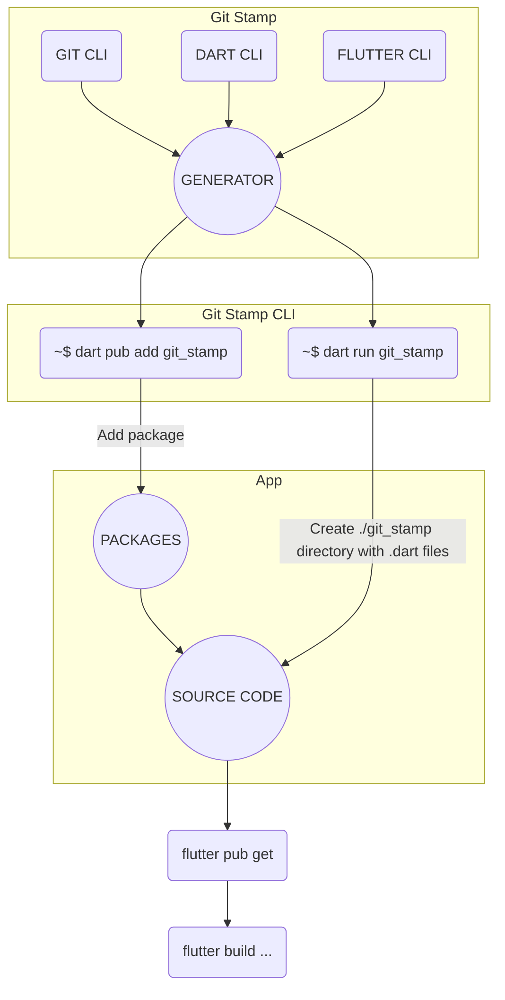

# 🕯️ Mechanism

```mermaid
graph TD
    CODE((SOURCE CODE))-->SYNC(flutter pub get)
    SYNC-->BUILD(flutter build ...)

    subgraph "App"
        CODE
        PUB
        PUB((PACKAGES))-->CODE
    end

    subgraph "Git Stamp"
        GIT_CLI(GIT CLI)-->GENERATOR
        DART_CLI(DART CLI)-->GENERATOR
        FLUTTER_CLI(FLUTTER CLI)-->GENERATOR
    end

    subgraph "Git Stamp CLI"
        GENERATE
        ADD
    end

    GENERATOR((GENERATOR))-->ADD(~$ dart pub add git_stamp)
    ADD-->|Add package|PUB

    GENERATOR-->GENERATE(~$ dart run git_stamp)
    GENERATE-->|Create ./git_stamp directory with .dart files|CODE
```