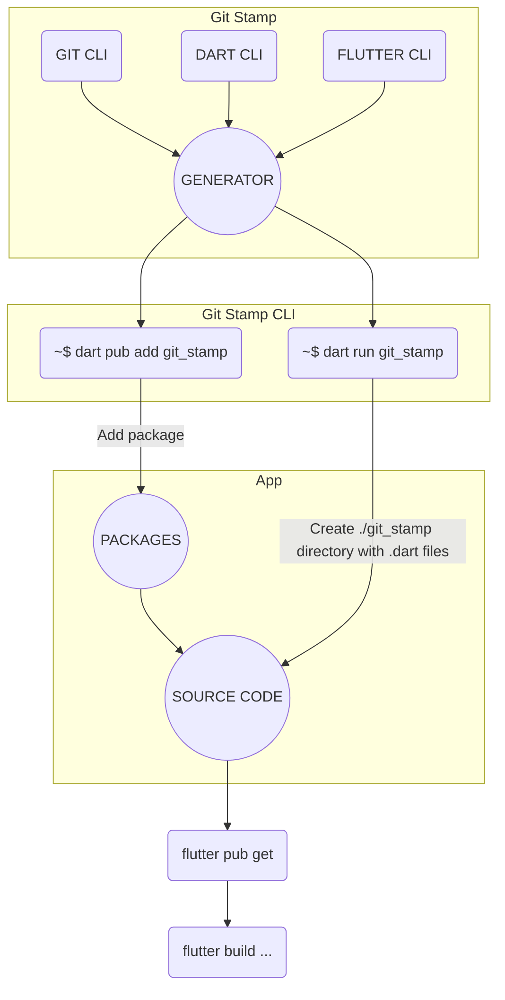

[](https://www.gov.pl/web/rolnictwo/produkt-polski1)

# Git Stamp 🏷

#### Build-Time Git Integration in Your Flutter App

[](https://github.com/arononak/git_stamp/tags)
[](https://github.com/arononak/git_stamp/)
[](https://github.com/arononak/git_stamp/graphs/contributors)


[](https://pub.dev/packages/git_stamp)
[](https://pub.dev/packages/git_stamp)
[](https://pub.dev/packages/git_stamp/publisher)

<!-- https://carbon.now.sh/ -->


## Table of contents
  
- [Git Stamp 🏷](#git-stamp-)
      - [Build-Time Git Integration in Your Flutter App](#build-time-git-history-integration-in-your-flutter-app)
  - [Table of contents](#table-of-contents)
  - [🏞️ Preview](#️-preview)
  - [🕯️ Mechanism](#️-mechanism)
  - [🛠️ Installation](#️-installation)
  - [🏗️ Generating](#️-generating)
  - [💻 Usage](#-usage)
      - [Default usage:](#default-usage)
      - [Advanced usage:](#advanced-usage)
  - [🔧 Git Stamp - Development](#-git-stamp-development)
  - [📝 License](#-license)

## 🏞️ Preview

|                                      Light                                      |                                      Dark                                      |
| :-----------------------------------------------------------------------------: | :----------------------------------------------------------------------------: |
|  |  |

## 🕯️ Mechanism



## 🛠️ Installation

```
  dart pub add git_stamp
```

or

```yaml
dev_dependencies:
  git_stamp: ^2.6.0
```

or

```yaml
dependencies:
  url_launcher: ^6.2.3
dev_dependencies:
  git_stamp:
    git:
      url: https://github.com/arononak/git_stamp
      ref: main
```

> [!IMPORTANT]
> Add **git_stamp** to .gitignore.
> 
> ```echo "lib/git_stamp/" >> .gitignore```.

## 🏗️ Generating

| CLI Command                                                       | Build type | Use ```url_launcher``` |
| ----------------------------------------------------------------- | ---------- | ---------------------- |
| `dart run git_stamp`                                              | LITE       | DISABLED               |
| `dart run git_stamp --build-type full --gen-url-launcher enabled` | FULL       | ENABLED                |
| `dart run git_stamp --gen-only build-branch,build-date-time`      | CUSTOM     | DISABLED               |

| `gen-only` parameters |
| --------------------- |
| `commit-list`         |
| `diff-list`           |
| `repo-creation-date`  |
| `build-branch`        |
| `build-date-time`     |
| `build-system-info`   |
| `repo-path`           |
| `observed-files-list` |


```bash
aron@vivobook-x7400pc-ubuntu:~/git_stamp/example$ dart run git_stamp
Building package executable... 
Built git_stamp:git_stamp.

    ┏┓•   ┏┓          ┏┓               
    ┃┓┓╋  ┗┓╋┏┓┏┳┓┏┓  ┃┓┏┓┏┓┏┓┏┓┏┓╋┏┓┏┓
    ┗┛┗┗  ┗┛┗┗┻┛┗┗┣┛  ┗┛┗ ┛┗┗ ┛ ┗┻┗┗┛┛ 
                  ┛                    
    
Build Type: lite
Use [url_launcher]: false

Generated - 1.34 KB 	 lib/git_stamp/git_stamp.dart
Generated - 570.00 B 	 lib/git_stamp/src/git_stamp_commit.dart
Generated - 37.51 KB 	 lib/git_stamp/src/data/commit_list.dart
Generated - 44.00 B 	 lib/git_stamp/src/data/diff_list.dart
Generated - 55.00 B 	 lib/git_stamp/src/data/repo_creation_date.dart
Generated - 35.00 B 	 lib/git_stamp/src/data/build_branch.dart
Generated - 52.00 B 	 lib/git_stamp/src/data/build_date_time.dart
Generated - 131.00 B 	 lib/git_stamp/src/data/build_system_info.dart
Generated - 48.00 B 	 lib/git_stamp/src/data/repo_path.dart
Generated - 3.68 KB 	 lib/git_stamp/src/data/observed_files_list.dart
Generated - 35.00 B 	 lib/git_stamp/src/data/is_lite_version.dart
Generated - 15.03 KB 	 lib/git_stamp/src/git_stamp_page.dart
Generated - 898.00 B 	 lib/git_stamp/src/git_stamp_details_page.dart
Generated - 1.08 KB 	 lib/git_stamp/src/git_stamp_utils.dart
Generated - 83.00 B 	 lib/git_stamp/src/git_stamp_launcher.dart
```


> [!CAUTION]
> Generating requires the use of the `git` command-line interface (CLI).

> [!IMPORTANT]
> If you use Github Action, you only get a single commit because GitHub Actions by default only retrieves the latest version (single commit) and does not include the full history of the repository. This is normal behavior to optimize the build process and improve performance, especially for large repositories. Try configuring github actions or generating Git Stamp files before `git push`.

## 💻 Usage

#### Default usage:

```dart
if (isProd == false) ...[
  IconButton(
    onPressed: () => showGitStampPage(context: context),
    icon: const Icon(Icons.book),
  ),
],
```

#### Advanced usage:

Central **GitStamp** node:

```dart
class GitStamp {
   static List<GitStampCommit> commitList
   static GitStampCommit latestCommit

   static const Map<String, String> diffList

   static const String buildBranch
   static const String buildDateTime
   static const String buildSystemInfo
   static const String repoCreationDate
   static const String repoPath
   static const String observedFilesList

   static const bool isLiteVersion
}
```

Example usage:

```dart
import 'git_stamp.dart';

Text('Version: v1.2.3'),
Text('Build: 1234'),
Text('Branch: ${GitStamp.buildBranch}'),
Text('SHA: ${GitStamp.latestCommit.hash}'),
```

## [🔧 Git Stamp - Development](./TODO.md)

| Step                    | Description                  |
| ----------------------- | ---------------------------- |
| 🔧 Run `pana` command   | Check 160/160 points         |
| 📸 New SS               | Create a new screenshots     |
| 🏷️ New tag and push     | Deploy every **Wednesday !** |

#### Package structure

## 📝 License

> [!NOTE]
> Copyright © 2024 Aron Onak. All rights reserved.<br>
> Licensed under the [MIT](LICENSE) license.<br>
> If you have any feedback, please contact me at arononak@gmail.com
