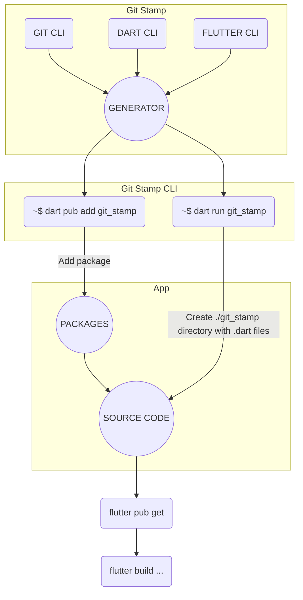

[](https://www.gov.pl/web/rolnictwo/produkt-polski1)

# [Git Stamp 🏷](./TODO.md)

Provides information about the project's Git repository and more. From simple information such as `build-branch` to a screen with Flutter code with commits and change history.

[](https://github.com/arononak/git_stamp/tags)
[](https://github.com/arononak/git_stamp/)
[](https://github.com/arononak/git_stamp/graphs/contributors)


[](https://pub.dev/packages/git_stamp)
[](https://pub.dev/packages/git_stamp)
[](https://pub.dev/packages/git_stamp/publisher)

## Table of contents
  
- [Git Stamp 🏷](#git-stamp-)
  - [Table of contents](#table-of-contents)
  - [🏞️ Preview](#️-preview)
  - [🕯️ Mechanism](#️-mechanism)
  - [🛠️ Installation](#️-installation)
  - [📦 Integration](#-integration)
  - [🏗️ Generating](#️-generating)
  - [💻 Usage](#-usage)
      - [ListTile](#listtile)
      - [IconButton](#iconbutton)
  - [📝 License](#-license)

## 🏞️ Preview

GitStamp Icon


GitStamp Page

|                                      Light                                      |                                      Dark                                      |
| :-----------------------------------------------------------------------------: | :----------------------------------------------------------------------------: |
|  |  |

The main motivation was **Minecraft** with information like this:
```
Version: v1.20.81
Build: 24130126
Branch: r/20_u8
SHA: a9081c5429038dcf3f26269f7351d89f
```

Git Stamp code:
```dart
import 'git_stamp/git_stamp.dart';

Text('Version: ${GitStamp.appVersion}'),
Text('Build: ${GitStamp.appBuild}'),
Text('Branch: ${GitStamp.buildBranch}'),
Text('SHA: ${GitStamp.latestCommit.hash}'),
```

## 🕯️ Mechanism



## 🛠️ Installation

<!-- https://snappify.com/ -->


If you use `url_launcher` generation, add the package to `pubspec.yaml`:

```yaml
dependencies:
  url_launcher: ^6.2.3
dev_dependencies:
  git_stamp:
    git:
      url: https://github.com/arononak/git_stamp
      ref: main
```

> [!WARNING]
> Add badge to your `README.md` 😄️
>
> [](https://github.com/arononak/git_stamp)
>
>```
>[](https://github.com/arononak/git_stamp)
>```

> [!IMPORTANT]
> Add **git_stamp** to .gitignore.
> 
> ```echo "lib/git_stamp/" >> .gitignore```.
> 
> If you add a **/git_stamp** folder for the repository and use the `FULL` version, the size of the repository will grow EXPONENTIALLY.


## 📦 Integration

Example GitHub Actions file:

`.github/workflows/build_and_deploy.yml`

```yml
name: build_and_deploy

on:
  push:
    branches: [main]
  pull_request_target:
    branches: [main]

jobs:
  build:
    runs-on: ubuntu-latest
    steps:
      - uses: actions/checkout@v3
      - uses: subosito/flutter-action@v2
        with:
          flutter-version: '3.22.2'
          channel: 'stable'
      - run: flutter --version
      - uses: actions/setup-java@v1
        with:
          java-version: "12.x"
      - run: flutter pub get
      - run: dart run git_stamp
      - run: flutter build web --release --web-renderer canvaskit
      - uses: actions/upload-artifact@master
        with:
          name: build
          path: build/web
  deploy:
    name: "Deploy"
    runs-on: ubuntu-latest
    needs: build
    steps:
      - uses: actions/checkout@v3
      - uses: actions/download-artifact@master
        with:
          name: build
          path: build/web
      - uses: FirebaseExtended/action-hosting-deploy@v0
        with:
          repoToken: "${{ secrets.GITHUB_TOKEN }}"
          firebaseServiceAccount: "${{ secrets.FIREBASE_SERVICE_ACCOUNT }}"
          projectId: xxx
          channelId: live
```

> [!IMPORTANT]
> If you use Github Action, you only get a single commit because GitHub Actions by default only retrieves the latest version (single commit) and does not include the full history of the repository. This is normal behavior to optimize the build process and improve performance, especially for large repositories. Try configuring github actions or generating Git Stamp files before `git push`.

## 🏗️ Generating

| CLI Command                                                       | Build type | Use ```url_launcher``` | Generate Flutter UI Files |
| ----------------------------------------------------------------- | ---------- | ---------------------- | ------------------------- |
| `dart run git_stamp`                                              | LITE       | DISABLED               | YES                       |
| `dart run git_stamp --build-type full --gen-url-launcher enabled` | FULL       | ENABLED                | YES                       |
| `dart run git_stamp --gen-only build-branch,build-date-time`      | CUSTOM     | DISABLED               | NO                        |

> [!CAUTION]
> Generating requires the use of the `git` command-line interface (CLI).

| `gen-only` parameters |
| --------------------- |
| `commit-list`         |
| `diff-list`           |
| `repo-creation-date`  |
| `build-branch`        |
| `build-date-time`     |
| `build-system-info`   |
| `repo-path`           |
| `observed-files-list` |
| `app-version`         |

## 💻 Usage

#### ListTile

```dart
if (kDebugMode) ...[
  ListTile(
    title: const Text('Git Stamp'),
    subtitle: Text(GitStamp.latestCommit.hash),
    leading: const Icon(Icons.commit),
    onTap: () => showGitStampPage(context: context),
  ),
],
```

#### IconButton
```dart
if (isProd == false) ...[
  IconButton(
    onPressed: () => showGitStampPage(context: context),
    icon: const Icon(Icons.book),
  ),
],
```

Central **GitStamp** node for advanced usage:

```dart
class GitStamp {
   static List<GitStampCommit> commitList
   static GitStampCommit latestCommit

   static const Map<String, String> diffList

   static const String buildBranch
   static const String buildDateTime
   static const String buildSystemInfo
   static const String repoCreationDate
   static const String repoPath
   static const String observedFilesList

   static const String appVersion
   static const String appBuild

   static const bool isLiteVersion
}
```

## 📝 License

> [!NOTE]
> Copyright © 2024 Aron Onak. All rights reserved.<br>
> Licensed under the [MIT](LICENSE) license.<br>
> If you have any feedback, please contact me at arononak@gmail.com
