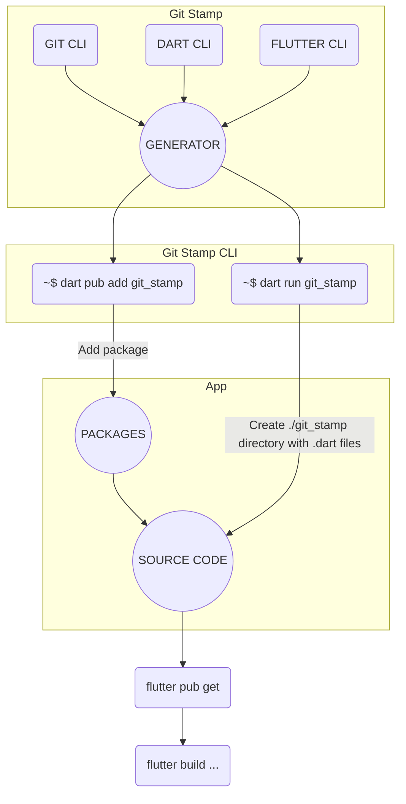

# [Git Stamp 🏷](TODO.md) Stamp Every App Build!

Advanced await-less **information provider** & **development tool**.

[](https://github.com/arononak/git_stamp/tags)
[](https://github.com/arononak/git_stamp/)
[](https://github.com/arononak/git_stamp/graphs/contributors)


[](https://pub.dev/packages/git_stamp)
[](https://pub.dev/packages/git_stamp)
[](https://pub.dev/packages/git_stamp/publisher)

[](https://pub.dev/packages/git_stamp)

- [Git Stamp 🏷 Stamp Every App Build!](#git-stamp--stamp-every-app-build)
  - [🏞️ Preview](#️-preview)
  - [📑️ About (Changelog)](#️-about-changelog)
    - [Why Git Stamp?](#why-git-stamp)
    - [Inspiration](#inspiration)
  - [🛠️ Installation](#️-installation)
  - [🏗️ Generating](#️-generating)
  - [💻 Usage](#-usage)
  - [🔥Contributors](#contributors)
  - [💰 Sponsors](#-sponsors)
  - [📝 License](#-license)

## [🏞️ Preview](PREVIEW.md)

<p align="center">
  <a href="https://gitstamp.web.app"><b>Example</b></a> •
  <a href="https://gitstamp-encrypted.web.app"><b>Example Encrypted</b></a> •
  <a href="https://arononak.github.io/git_stamp/doc/api/index.html"><b>API Documentation</b></a>
</p>

<table>
  <tr>
    <td></td>
    <td></td>
  </tr>
</table>

## 📑️ About ([Changelog](CHANGELOG.md))

[](https://www.gov.pl/web/rolnictwo/produkt-polski1)

### Why Git Stamp?

When working with **Flutter** and **Git**, especially in a team environment, human errors such as forgetting to run git pull can lead to issues during branch merges. Git Stamp helps address these problems by offering:
- **Build Date, SHA & Branch Information** - Git Stamp allows you to precisely determine which version of the application was deployed. This is especially useful during debugging or verifying issues, as application versions and build numbers are not always updated correctly.
- **Debugging and Troubleshooting** - Knowing the build date and exact code version (SHA) makes it much easier for the development team to identify the problematic code when users report bugs.
- **Avoiding Lost Changes in Teamwork** - It allows you to quickly see which commits made it into the final version of the application, helping to prevent missing changes due to overlooked `git pull` commands.
- **Caching Issues in the Web Version** - Even if the latest version is deployed, users may still see an older version due to caching. Git Stamp helps identify whether the deployed version or an outdated one was loaded.

<details>
<summary>Mechanism 🕯️</summary>



</details>

### Inspiration

The main inspiration was **Minecraft** with information like this:
```
Version: v1.20.81
Build: 24130126
Branch: r/20_u8
SHA: a9081c5429038dcf3f26269f7351d89f
```

Git Stamp code:
```dart
import 'git_stamp/git_stamp.dart';

Text('Version: ${GitStamp.appVersion}'),
Text('Build: ${GitStamp.appBuild}'),
Text('Branch: ${GitStamp.buildBranch}'),
Text('SHA: ${GitStamp.sha}'),
```

## [🛠️ Installation](INSTALLATION.md)

```yml
dependencies:
  git_stamp: ^5.2.0
dependency_overrides:
  meta: ^1.1.5
```

## [🏗️ Generating](GENERATING.md)

```cli
dart run git_stamp --build-type full
```

## [💻 Usage](USAGE.md)

```dart
if (kDebugMode) ...[
  GitStamp.listTile(
    context: context,
    monospaceFontFamily: GoogleFonts.spaceMono().fontFamily,
  ),
],
```

## 🔥Contributors

<a href="https://github.com/arononak/git_stamp/graphs/contributors">
  
</a>

## 💰 Sponsors

|                         [Aron Code](https://aroncode.com)                         |
| :-------------------------------------------------------------------------------: |
|  |

## 📝 License

> [!NOTE]
> Copyright © 2024 Aron Onak. All rights reserved.<br>
> Licensed under the [MIT](LICENSE) license.<br>
> If you have any feedback, please contact me at arononak@gmail.com
