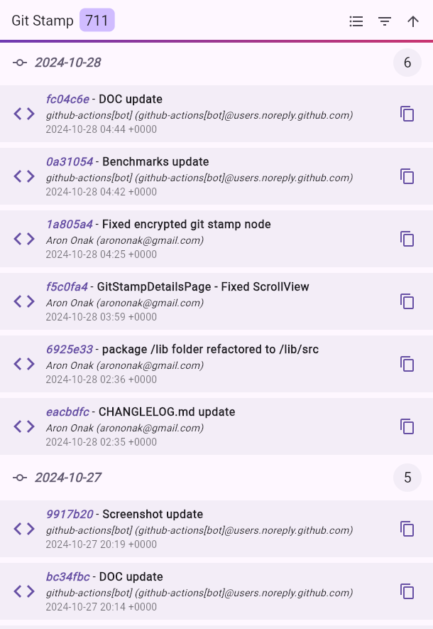
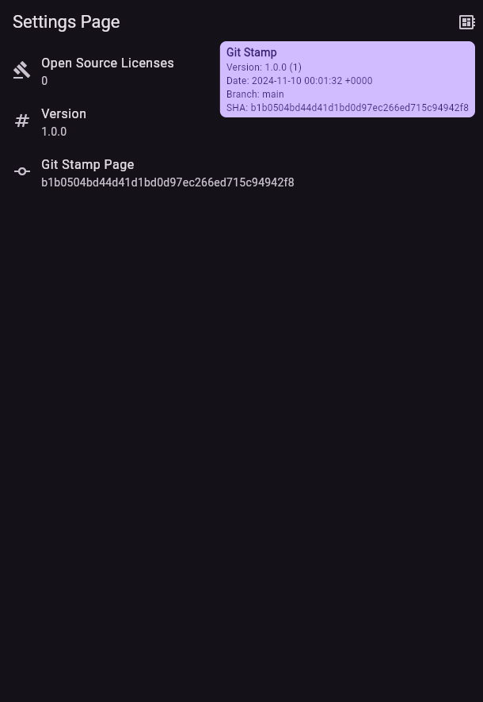
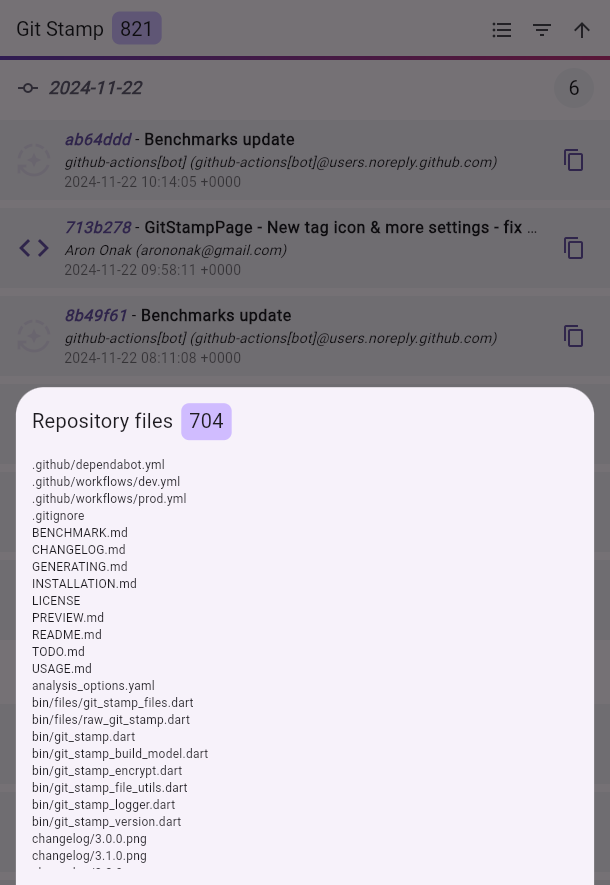
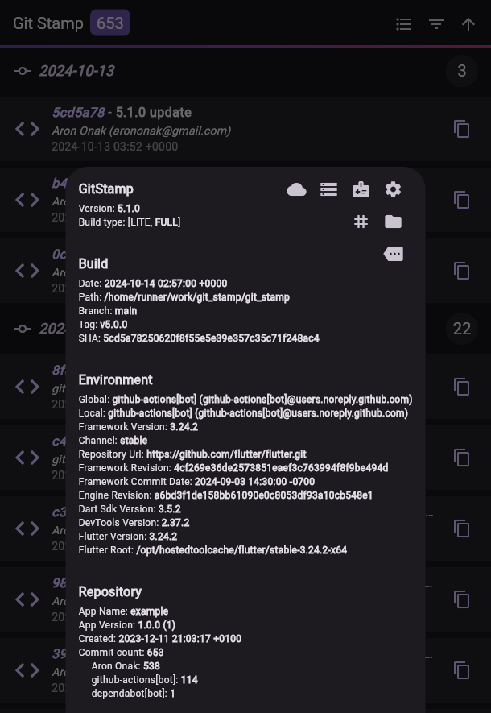
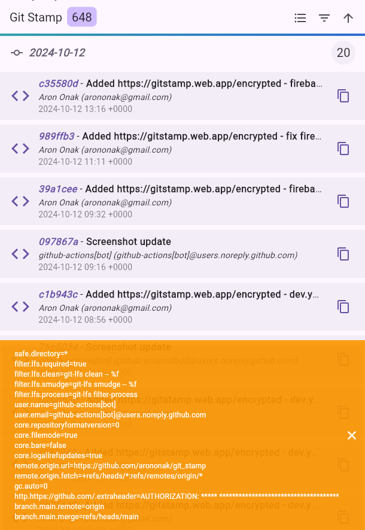
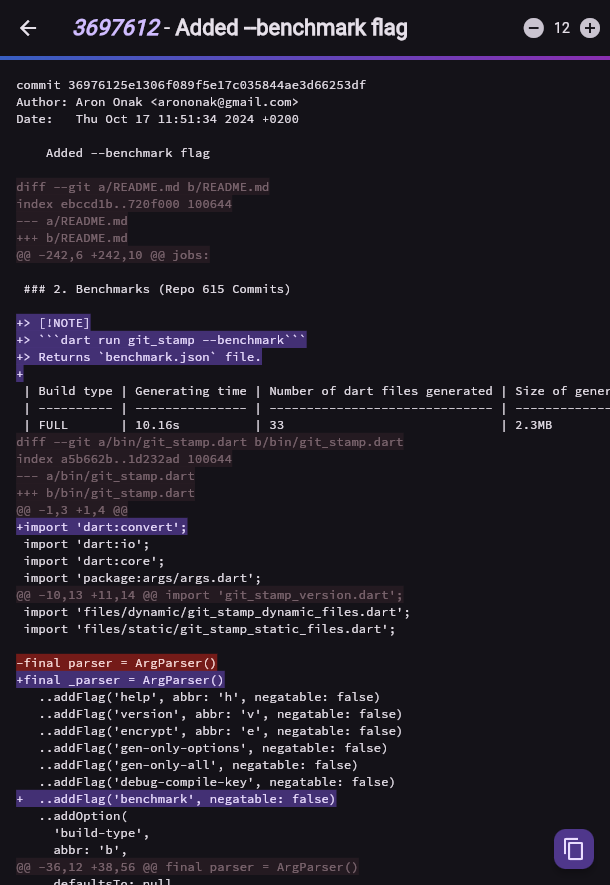
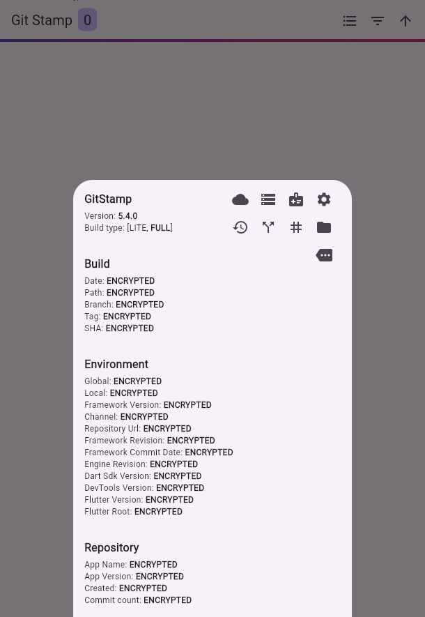
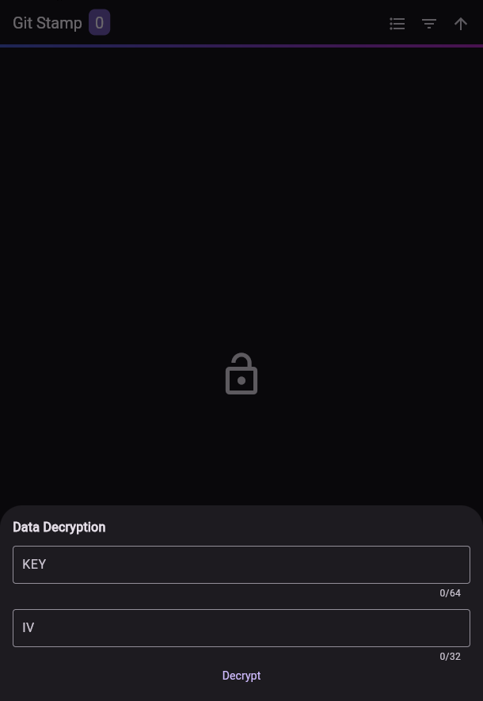
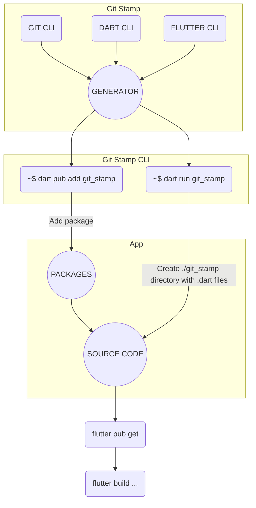

# [Git Stamp 🏷](./TODO.md) Stamp Every App Build!

Advanced await-less information provider and development tool.

[](https://github.com/arononak/git_stamp/tags)
[](https://github.com/arononak/git_stamp/)
[](https://github.com/arononak/git_stamp/graphs/contributors)


[](https://pub.dev/packages/git_stamp)
[](https://pub.dev/packages/git_stamp)
[](https://pub.dev/packages/git_stamp/publisher)

[](https://pub.dev/packages/git_stamp)

- [Git Stamp 🏷 Stamp Every App Build!](#git-stamp--stamp-every-app-build)
  - [🏞️ Preview](#️-preview)
  - [📑️ About](#️-about)
    - [1. Why Git Stamp?](#1-why-git-stamp)
    - [2. 🕯️ Mechanism](#2-️-mechanism)
    - [3. Motivation](#3-motivation)
    - [4. Changelog](#4-changelog)
  - [🛠️ Installation](#️-installation)
    - [1. `pubspec.yaml`](#1-pubspecyaml)
    - [2. `.gitignore`](#2-gitignore)
    - [3. `analysis_options.yaml`](#3-analysis_optionsyaml)
    - [4. `README.md`](#4-readmemd)
    - [5. 📦 Integration - GitHub Actions](#5--integration---github-actions)
  - [🏗️ Generating](#️-generating)
    - [1. Examples](#1-examples)
    - [2. Benchmarks (Repo 615 Commits)](#2-benchmarks-repo-615-commits)
    - [3. Tip](#3-tip)
    - [4. Custom `gen-only` parameters](#4-custom-gen-only-parameters)
  - [💻 Usage](#-usage)
    - [1. GitStampListTile](#1-gitstamplisttile)
    - [2. GitStampIcon](#2-gitstampicon)
    - [3. Custom](#3-custom)
    - [4. showGitStampLicensePage()](#4-showgitstamplicensepage)
    - [5. Central **GitStamp** node for advanced usage:](#5-central-gitstamp-node-for-advanced-usage)
  - [💰 Sponsors](#-sponsors)
  - [📝 License](#-license)

## 🏞️ Preview
  
| Type         | Link                                                             |
| ------------ | ---------------------------------------------------------------- |
| 📂 Decrypted | [gitstamp.web.app](https://gitstamp.web.app)                     |
| 🔒 Encrypted | [gitstamp-encrypted.web.app](https://gitstamp-encrypted.web.app) |


|                                   |                             |
| :-------------------------------: | :-------------------------: |
|               |         |
|              |      |
|         |  |
|  |      |


## 📑️ About

[](https://www.gov.pl/web/rolnictwo/produkt-polski1)

### 1. Why Git Stamp?

When working with **Flutter** and **Git**, especially in a team environment, human errors such as forgetting to run git pull can lead to issues during branch merges. Git Stamp helps address these problems by offering:
- **Build Date, SHA & Branch Information** - Git Stamp allows you to precisely determine which version of the application was deployed. This is especially useful during debugging or verifying issues, as application versions and build numbers are not always updated correctly.
- **Debugging and Troubleshooting** - Knowing the build date and exact code version (SHA) makes it much easier for the development team to identify the problematic code when users report bugs.
- **Avoiding Lost Changes in Teamwork** - It allows you to quickly see which commits made it into the final version of the application, helping to prevent missing changes due to overlooked `git pull` commands.
- **Caching Issues in the Web Version** - Even if the latest version is deployed, users may still see an older version due to caching. Git Stamp helps identify whether the deployed version or an outdated one was loaded.

### 2. 🕯️ Mechanism



### 3. Motivation

The main motivation was **Minecraft** with information like this:
```
Version: v1.20.81
Build: 24130126
Branch: r/20_u8
SHA: a9081c5429038dcf3f26269f7351d89f
```

Git Stamp code:
```dart
import 'git_stamp/git_stamp.dart';

Text('Version: ${GitStamp.appVersion}'),
Text('Build: ${GitStamp.appBuild}'),
Text('Branch: ${GitStamp.buildBranch}'),
Text('SHA: ${GitStamp.sha}'),
```

### 4. [Changelog](./CHANGELOG.md)

| 🆕 **Version** | 🗓️ **Date**         | 📝 **Change Description**    |
| ------------- | ------------------ | --------------------------- |
| Version 6     | Someday it will be | 📦 JSON data export          |
| Version 5     | 07.10.2024         | 🔐 Data encription           |
| Version 4     | 24.07.2024         | 🌟 New `icon` build-type     |
| Version 3     | 30.06.2024         | 🔧 New `gen-only` build-type |
| Version 2     | 10.04.2024         | 🛠️ Commit diff               |
| Version 1     | 11.12.2023         | 🚀 First version             |

## 🛠️ Installation

### 1. `pubspec.yaml`

```
dart pub add git_stamp
```

```dart
dependency_overrides:
  meta: ^1.1.5
```

### 2. `.gitignore`

> [!IMPORTANT]
> Add **git_stamp** to .gitignore.
> 
> ```echo -e "\n/lib/git_stamp/" >> .gitignore```.
> 
> If you add a **/git_stamp** folder for the repository and use the `FULL` version, the size of the repository will grow EXPONENTIALLY.

### 3. `analysis_options.yaml`

```yaml
analyzer:
  exclude:
    - lib/git_stamp/**
```

### 4. `README.md`

> [!WARNING]
> Add badge to your `README.md` 😄️
>
> [](https://github.com/arononak/git_stamp)
>
>```
>[](https://github.com/arononak/git_stamp)
>```

### 5. 📦 Integration - GitHub Actions

<details>
<summary>.github/workflows/build_and_deploy.yml</summary>

```yml
name: build_and_deploy

on:
  push:
    branches: [main]
  pull_request_target:
    branches: [main]

jobs:
  build:
    runs-on: ubuntu-latest
    steps:
      - uses: actions/checkout@v3
        with:
          fetch-depth: 0
      - uses: subosito/flutter-action@v2
        with:
          flutter-version: '3.22.2'
          channel: 'stable'
      - run: flutter --version
      - uses: actions/setup-java@v1
        with:
          java-version: "12.x"
      - run: flutter pub get
      - run: dart run git_stamp
      - run: flutter build web --release --web-renderer canvaskit
      - uses: actions/upload-artifact@master
        with:
          name: build
          path: build/web
  deploy:
    name: "Deploy"
    runs-on: ubuntu-latest
    needs: build
    steps:
      - uses: actions/checkout@v3
      - uses: actions/download-artifact@master
        with:
          name: build
          path: build/web
      - uses: FirebaseExtended/action-hosting-deploy@v0
        with:
          repoToken: "${{ secrets.GITHUB_TOKEN }}"
          firebaseServiceAccount: "${{ secrets.FIREBASE_SERVICE_ACCOUNT }}"
          projectId: xxx
          channelId: live
```

</details>

## 🏗️ Generating

### 1. Examples

| Build type | Pure Dart | Can encrypt | CLI Command                                                                 |
| ---------- | --------- | ----------- | --------------------------------------------------------------------------- |
| FULL       | NO        | YES         | `dart run git_stamp --build-type full --adding-packages disabled --encrypt` |
| LITE       | NO        | YES         | `dart run git_stamp`                                                        |
| ICON       | NO        | NO          | `dart run git_stamp --build-type icon`                                      |
| CUSTOM     | YES       | NO          | `dart run git_stamp --gen-only build-branch,build-date-time`                |

> [!NOTE]
> To optimize the generation you can disable adding packages to the project for LITE & FULL versions by adding a flag in CLI `--adding-packages disabled` .

### 2. Benchmarks (Repo 615 Commits)

| Build type | Generating time | Number of dart files generated | Size of generated dart files |
| ---------- | --------------- | ------------------------------ | ---------------------------- |
| FULL       | 10.16s          | 33                             | 2.3MB                        |
| LITE       | 3.73s           | 33                             | 167.9 KB                     |
| ICON       | 1.26s           | 10                             | 8.8 KB                       |

### 3. Tip

> [!CAUTION]
> Generating requires the use of the `git` command-line interface (CLI).

### 4. Custom `gen-only` parameters 

| #   | Parameter           |
| --- | ------------------- |
| 1   | commit-list         |
| 2   | diff-list           |
| 3   | diff-stat-list      |
| 4   | repo-creation-date  |
| 5   | build-branch        |
| 6   | build-date-time     |
| 7   | build-system-info   |
| 8   | build-machine       |
| 9   | repo-path           |
| 10  | observed-files-list |
| 11  | app-version         |
| 12  | app-build           |
| 13  | app-name            |
| 14  | git-config          |
| 15  | git-remote          |
| 16  | git-remote-list     |
| 17  | git-tag-list        |
| 18  | git-branch-list     |

## 💻 Usage

### 1. GitStampListTile

```dart
if (kDebugMode) ...[
  GitStampListTile(monospaceFontFamily: GoogleFonts.spaceMono().fontFamily),
],
```

### 2. GitStampIcon
```dart
if (isProd == false) ...[
  GitStampIcon(),
],
```

### 3. Custom
```dart
if (isProd == false) ...[
  IconButton(
    onPressed: () => showGitStampPage(context: context, monospaceFontFamily: GoogleFonts.spaceMono().fontFamily),
    icon: const Icon(Icons.book),
  ),
],
```

### 4. showGitStampLicensePage()

> [!NOTE]
> Use function `GitStamp.showLicensePage` instead of `showLicensePage` if you want the `name` and `version` to be added automatically.

### 5. Central **GitStamp** node for advanced usage:

<details>
<summary>GitStampNode</summary>

```dart
abstract class GitStampNode {
  String get commitListString;
  List<GitStampCommit> get commitList;
  GitStampCommit? get latestCommit;
  String get sha;
  int get commitCount;

  String get diffListString;
  Map<String, dynamic> get diffList;
  String get diffStatListString;
  Map<String, dynamic> get diffStatList;

  String get buildMachineString;
  GitStampBuildMachine get buildMachine;

  String get buildBranch;
  String get buildDateTime;
  String get buildSystemInfo;
  String get repoCreationDate;
  String get repoPath;

  String get observedFiles;
  List<String> get observedFilesList;
  int get observedFilesCount;

  String get tagListString;
  List<String> get tagList;
  int get tagListCount;

  String get branchListString;
  List<String> get branchList;
  int get branchListCount;

  String get appVersionFull => appVersion + ' (' + appBuild + ')';
  String get appVersion;
  String get appBuild;
  String get appName;

  String get gitConfigGlobalUser => gitConfigGlobalUserName + ' (' + gitConfigGlobalUserEmail + ')';
  String get gitConfigGlobalUserName;
  String get gitConfigGlobalUserEmail;

  String get gitConfigUser => gitConfigUserName + ' (' + gitConfigUserEmail + ')';
  String get gitConfigUserName;
  String get gitConfigUserEmail;

  String get gitRemote;
  String get gitConfigList;
  String get gitCountObjects;

  void showLicensePage({
    required BuildContext context,
    Widget? applicationIcon,
    String? applicationLegalese,
    bool useRootNavigator = false,
  });
}
```

</details>

## 💰 Sponsors

| [Aron Code](https://aroncode.com) |
| :-------------------------------: |
|           |

## 📝 License

> [!NOTE]
> Copyright © 2024 Aron Onak. All rights reserved.<br>
> Licensed under the [MIT](LICENSE) license.<br>
> If you have any feedback, please contact me at arononak@gmail.com
