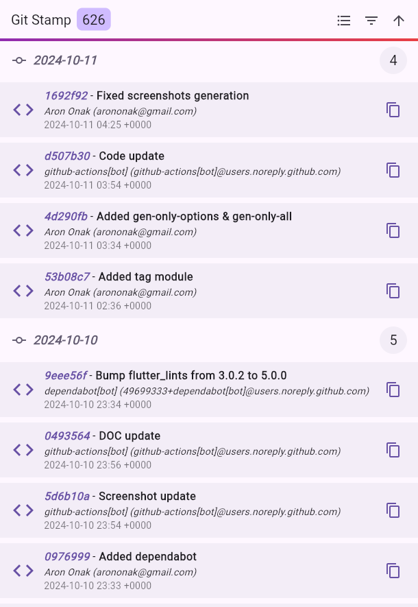
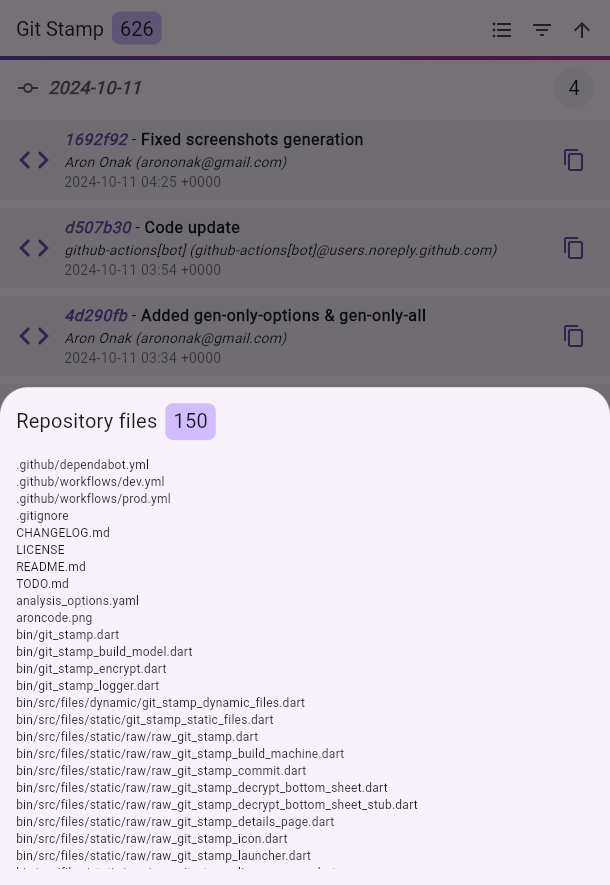
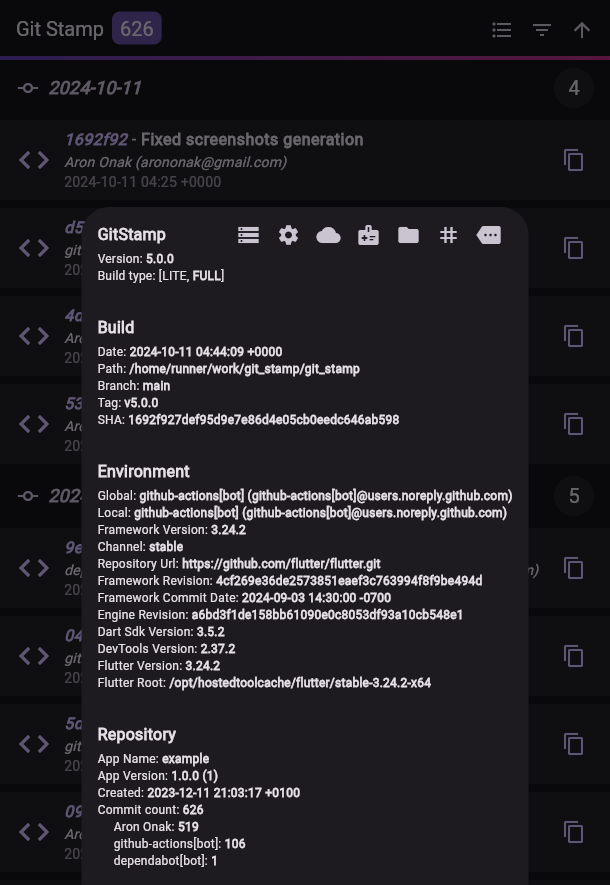
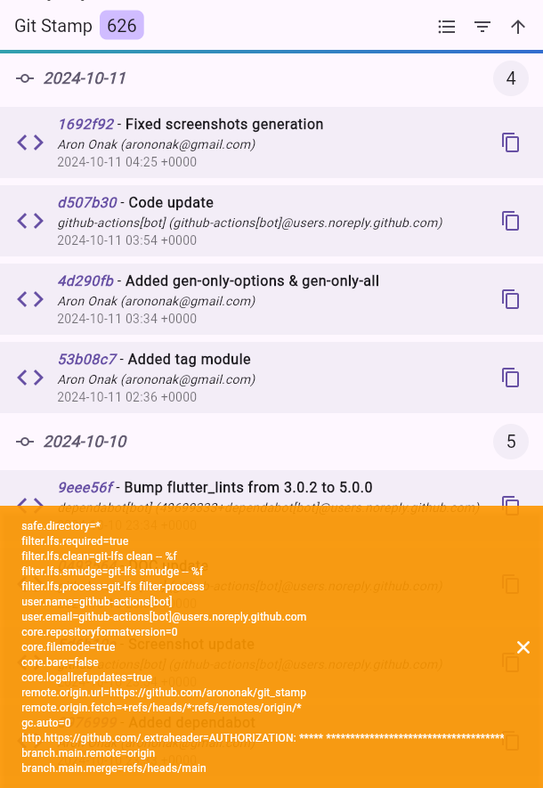
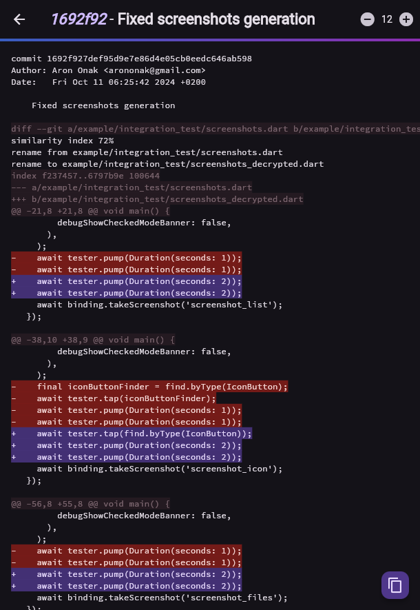

[](https://www.gov.pl/web/rolnictwo/produkt-polski1)

[](https://github.com/arononak/git_stamp/tags)
[](https://github.com/arononak/git_stamp/)
[](https://github.com/arononak/git_stamp/graphs/contributors)


[](https://pub.dev/packages/git_stamp)
[](https://pub.dev/packages/git_stamp)
[](https://pub.dev/packages/git_stamp/publisher)

# [Git Stamp 🏷](./TODO.md)

Advanced await-less information provider and development tool.

<details>
<summary>Table of Contents</summary>
  
- [Git Stamp 🏷](#git-stamp-)
  - [🏞️ Preview](#️-preview)
  - [📑️ About](#️-about)
    - [Why Git Stamp?](#why-git-stamp)
    - [Motivation](#motivation)
    - [Roadmap](#roadmap)
  - [🛠️ Installation](#️-installation)
    - [1. `pubspec.yaml`](#1-pubspecyaml)
    - [2. `.gitignore`](#2-gitignore)
    - [3. `analysis_options.yaml`](#3-analysis_optionsyaml)
    - [4. `README.md`](#4-readmemd)
  - [🏗️ Generating](#️-generating)
    - [1. Examples](#1-examples)
    - [2. Tip](#2-tip)
    - [3. Custom `gen-only` parameters](#3-custom-gen-only-parameters)
  - [💻 Usage](#-usage)
    - [1. GitStampListTile](#1-gitstamplisttile)
    - [2. GitStampIcon](#2-gitstampicon)
    - [3. custom](#3-custom)
    - [4. showGitStampLicensePage()](#4-showgitstamplicensepage)
    - [5. Central **GitStamp** node for advanced usage:](#5-central-gitstamp-node-for-advanced-usage)
  - [📦 Integration](#-integration)
    - [GitHub Actions](#github-actions)
  - [📝 License](#-license)

</details>

## 🏞️ Preview

| [🌀 Example](https://gitstamp.web.app) | [How it work?](./MECHANISM.md)   |
| :------------------------------------: | :------------------------------: |
|               |         |
|              |      |
|         |  |

## 📑️ About

### Why Git Stamp?
When working with Flutter and Git, especially in a team environment, human errors such as forgetting to run git pull can lead to issues during branch merges. Git Stamp helps address these problems by offering:
- **Build Date, SHA & Branch Information** - Git Stamp allows you to precisely determine which version of the application was deployed. This is especially useful during debugging or verifying issues, as application versions and build numbers are not always updated correctly.
- **Debugging and Troubleshooting** - Knowing the build date and exact code version (SHA) makes it much easier for the development team to identify the problematic code when users report bugs.
- **Avoiding Lost Changes in Teamwork** - It allows you to quickly see which commits made it into the final version of the application, helping to prevent missing changes due to overlooked git pull commands.
- **Caching Issues in the Web Version** - Even if the latest version is deployed, users may still see an older version due to caching. Git Stamp helps identify whether the deployed version or an outdated one was loaded.

### Motivation

The main motivation was **Minecraft** with information like this:
```
Version: v1.20.81
Build: 24130126
Branch: r/20_u8
SHA: a9081c5429038dcf3f26269f7351d89f
```

Git Stamp code:
```dart
import 'git_stamp/git_stamp.dart';

Text('Version: ${GitStamp.appVersion}'),
Text('Build: ${GitStamp.appBuild}'),
Text('Branch: ${GitStamp.buildBranch}'),
Text('SHA: ${GitStamp.sha}'),
```

### Roadmap

Changelogs ([Text](./CHANGELOG.md)) ([Image](./changelog/CHANGELOG.md))

| 🆕 **Version** | 🗓️ **Date**        |  📝 **Change Description**        |
|----------------|--------------------|-----------------------------------|
| Version 6      | Someday it will be | 📦 JSON data export               |
| Version 5      | Someday it will be | 🔐 Data encription                |
| Version 4      | 24.07.2024         | 🌟 New `icon` build-type          |
| Version 3      | 30.06.2024         | 🔧 New `gen-only` build-type      |
| Version 2      | 10.04.2024         | 🛠️ Commit diff                    |
| Version 1      | 11.12.2023         | 🚀 First version                  |


## 🛠️ Installation

### 1. `pubspec.yaml`

```
dart pub add git_stamp
```

### 2. `.gitignore`

> [!IMPORTANT]
> Add **git_stamp** to .gitignore.
> 
> ```echo -e "\n/lib/git_stamp/" >> .gitignore```.
> 
> If you add a **/git_stamp** folder for the repository and use the `FULL` version, the size of the repository will grow EXPONENTIALLY.

### 3. `analysis_options.yaml`

```yaml
analyzer:
  exclude:
    - lib/git_stamp/**
```

### 4. `README.md`

> [!WARNING]
> Add badge to your `README.md` 😄️
>
> [](https://github.com/arononak/git_stamp)
>
>```
>[](https://github.com/arononak/git_stamp)
>```

## 🏗️ Generating

### 1. Examples

| Build type | Pure Dart                  | CLI Command                                                  |
| ---------- | -------------------------- | ------------------------------------------------------------ |
| LITE       | NO                         | `dart run git_stamp`                                         |
| FULL       | NO                         | `dart run git_stamp --build-type full`                       |
| ICON       | NO                         | `dart run git_stamp --build-type icon`                       |
| CUSTOM     | YES                        | `dart run git_stamp --gen-only build-branch,build-date-time` |

### 2. Tip

> [!CAUTION]
> Generating requires the use of the `git` command-line interface (CLI).

### 3. Custom `gen-only` parameters 

| #  | Parameter          |
|----|--------------------|
| 1  | commit-list        |
| 2  | diff-list          |
| 3  | diff-stat-list     |
| 4  | repo-creation-date |
| 5  | build-branch       |
| 6  | build-date-time    |
| 7  | build-system-info  |
| 8  | build-machine      |
| 9  | repo-path          |
| 10 | observed-files-list|
| 11 | app-version        |
| 12 | app-build          |
| 13 | app-name           |
| 14 | git-config         |
| 15 | git-remote         |
| 15 | git-remote-list    |

## 💻 Usage

### 1. GitStampListTile

```dart
if (kDebugMode) ...[
  GitStampListTile(monospaceFontFamily: GoogleFonts.spaceMono().fontFamily),
],
```

### 2. GitStampIcon
```dart
if (isProd == false) ...[
  GitStampIcon(),
],
```

### 3. custom
```dart
if (isProd == false) ...[
  IconButton(
    onPressed: () => showGitStampPage(context: context, monospaceFontFamily: GoogleFonts.spaceMono().fontFamily),
    icon: const Icon(Icons.book),
  ),
],
```

### 4. showGitStampLicensePage()

> [!NOTE]
> Use function `GitStamp.showLicensePage` instead of `showLicensePage` if you want the `name` and `version` to be added automatically.

### 5. Central **GitStamp** node for advanced usage:

```dart
class GitStamp {
  static List<GitStampCommit> get commitList
  static GitStampCommit? get latestCommit
  static String get sha
  static int get commitCount

  static Map<String, dynamic> diffList
  static Map<String, dynamic> diffStatList

  static const String buildBranch
  static const String buildDateTime
  static const String buildSystemInfo
  static GitStampBuildMachine buildMachine
  static const String repoCreationDate
  static const String repoPath

  static String observedFiles
  static List<String> observedFilesList
  static int observedFilesCount

  static const String appVersion
  static const String appBuild
  static const String appName

  static const String gitConfigGlobalUserName
  static const String gitConfigGlobalUserEmail
  static const String gitConfigUserName
  static const String gitConfigUserEmail

  static const String gitRemote

  static showLicensePage({
    required BuildContext context,
    Widget? applicationIcon,
    String? applicationLegalese,
    bool useRootNavigator = false,
  })
}
```

## 📦 Integration

### GitHub Actions

<details>
<summary>.github/workflows/build_and_deploy.yml</summary>

```yml
name: build_and_deploy

on:
  push:
    branches: [main]
  pull_request_target:
    branches: [main]

jobs:
  build:
    runs-on: ubuntu-latest
    steps:
      - uses: actions/checkout@v3
        with:
          fetch-depth: 0
      - uses: subosito/flutter-action@v2
        with:
          flutter-version: '3.22.2'
          channel: 'stable'
      - run: flutter --version
      - uses: actions/setup-java@v1
        with:
          java-version: "12.x"
      - run: flutter pub get
      - run: dart run git_stamp
      - run: flutter build web --release --web-renderer canvaskit
      - uses: actions/upload-artifact@master
        with:
          name: build
          path: build/web
  deploy:
    name: "Deploy"
    runs-on: ubuntu-latest
    needs: build
    steps:
      - uses: actions/checkout@v3
      - uses: actions/download-artifact@master
        with:
          name: build
          path: build/web
      - uses: FirebaseExtended/action-hosting-deploy@v0
        with:
          repoToken: "${{ secrets.GITHUB_TOKEN }}"
          firebaseServiceAccount: "${{ secrets.FIREBASE_SERVICE_ACCOUNT }}"
          projectId: xxx
          channelId: live
```

</details>

## 📝 License

> [!NOTE]
> Copyright © 2024 Aron Onak. All rights reserved.<br>
> Licensed under the [MIT](LICENSE) license.<br>
> If you have any feedback, please contact me at arononak@gmail.com
